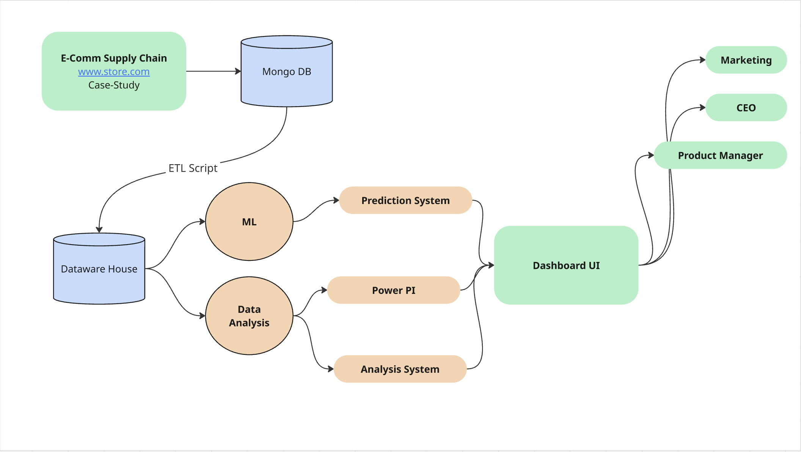

# Business Intelligence System – Full Technical Documentation

## 1. System Architecture Overview

The system relies on a complete data pipeline starting from an e-commerce store, passing through MongoDB, then moving into PostgreSQL Data Warehouse, ending with analytics, dashboards, and machine learning modules.

### High-Level Flow
E-Commerce Store → MongoDB → ETL Pipeline → PostgreSQL Data Warehouse → Data Analysis → Machine Learning → Dashboards

---

## 2. Data Sources

### E-commerce Store
- Source of all transactional and customer data.
- Contains: orders, users, products, reviews, campaign tracking.
- Sends data directly to **MongoDB** using API calls.

---

## 3. MongoDB (Operational Database)

### Purpose
MongoDB acts as the first landing zone for raw, unstructured or semi-structured data coming from the e-commerce platform.

### Stored Data
- Orders collection  
- Products collection  
- Users collection  
- Campaign logs  
- Reviews  

### Reason for Choosing MongoDB
- Fast write operations  
- Works well with JSON-like data  
- Flexible schema for e-commerce systems  

---

## 4. ETL Pipeline (Extract, Transform, Load)

A periodic process that moves data from MongoDB into PostgreSQL.

### 4.1 Extract
- Extract collections from MongoDB.
- Tools used:
  - **Python**
  - Libraries: `pymongo`, `pandas`

### 4.2 Transform
- Data cleaning and formatting:
  - Handle nulls  
  - Encode categorical fields  
  - Normalize tables (customers, orders, products, campaigns)  
  - Convert timestamps  
  - Remove duplicates  

- Tools used:
  - **Python**  
  - Libraries: `pandas`, `numpy`  

### 4.3 Load
- Load transformed data into PostgreSQL using:
  - `psycopg2` (Python)
  - SQL insert statements or bulk inserts

---

## 5. PostgreSQL (Data Warehouse Layer)

### Purpose
- Central data warehouse for structured analytics.
- Optimized for queries rather than real-time writes.

### Schema Design
**Tables:**
- `customers`
- `orders`
- `products`
- `order_items`
- `campaigns`
- `reviews`
- `daily_metrics`

### Why PostgreSQL?
- Strong relational capabilities  
- Excellent for analytics queries  
- Supports indexing & complex joins  

---

## 6. Data Analysis Layer

### Tools Used
- **Python + Jupyter Notebook**
- Libraries:
  - `pandas`
  - `matplotlib`
  - `seaborn`
  - `numpy`
  - `scipy`

### Analysis Performed
- Revenue trends  
- Profit calculation  
- Customer segmentation  
- Product performance metrics  
- Campaign ROI analysis  
- Order frequency & cohort analysis  

---

## 7. Machine Learning Module

### Algorithms Used

#### 1. Revenue & Profit Forecasting
- **Linear Regression**
- **Prophet Model**
- **ARIMA** (if time-series heavy)

#### 2. Product Performance Prediction
- **Random Forest**
- **XGBoost**

#### 3. Customer Segmentation
- **K-Means Clustering**

#### 4. Predicting customer behavior (optional)
- Classification using:
  - Logistic Regression
  - Random Forest

### Data Used
- Previous years revenue  
- Monthly profitability metrics  
- Product reviews  
- Customer purchase history  

---

## 8. Dashboards (BI Layer)

### Tools
- **Power BI** (main)
- Optional: Tableau / Looker

### CEO Dashboard
- Total revenue  
- Net profit  
- Total cost  
- Total orders  
- Orders last month  
- Best selling day  
- Average order value  
- Next-year ML forecast  

### Product Manager Dashboard
- Top products  
- Product trends  
- Review-based scoring  
- ML prediction for new product performance  

### Marketing Dashboard
- Campaign cost  
- Campaign revenue  
- Campaign ROI  
- New vs returning customers  
- Best products in each campaign  
- Demographics (gender, age groups)

---

## 9. Full System Flow (Step-by-Step)

### Step 1: E-commerce store sends data to MongoDB  
Real-time or periodic sync of customers / orders / products.

### Step 2: ETL Job pulls data from MongoDB  
Using Python scripts scheduled via:
- Cron jobs  
- Airflow (optional)  

### Step 3: Data is cleaned and transformed  
In Python before loading into PostgreSQL.

### Step 4: Clean data is inserted into PostgreSQL  
This becomes the analytics warehouse.

### Step 5: Analysis runs using Python notebooks  
KPIs are generated and saved back if needed.

### Step 6: ML models train on PostgreSQL data  
Models generate:
- Forecasts  
- Predictions  
- Segmentation  

### Step 7: Dashboards pull data from PostgreSQL  
Power BI connects directly to PostgreSQL to show all metrics.

---

## 10. Tech Stack Summary

### Backend & Data
- **MongoDB**
- **PostgreSQL**
- **Python (ETL + Analysis + ML)**  
- Libraries: `pymongo`, `psycopg2`, `pandas`, `numpy`, `sklearn`, `xgboost`

### BI / Visualization
- **Power BI**

### Infrastructure
- Cron Jobs  
- Optional: Airflow  
- Local or cloud hosting  

---

## 11. Final Notes
This architecture supports:
- Real-time e-commerce data ingestion  
- Clean structured analytics  
- Machine learning predictions  
- Role-based dashboards  
- Scalable future improvements  

